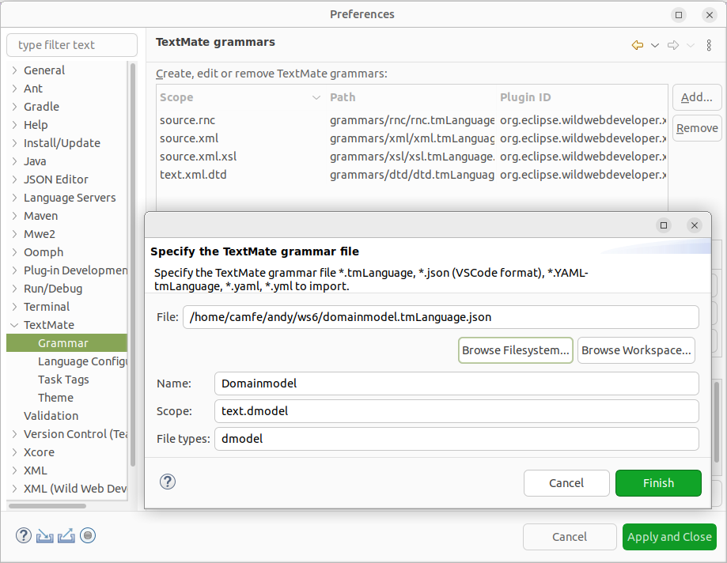

# {{page.title}} {#lsp-support}

Xtext supports the generation of language servers that comply to the [Language Server Protocol (LSP)](https://microsoft.github.io/language-server-protocol/).

## Getting Started in Eclipse {#getting-started-eclipse}

**Step 1:** Create a new Xtext Project with language server support and Maven as the preferred build system.


**Step 2:** Implement the Domainmodel language following the [Xtext - 15 Minutes Tutorial](https://www.eclipse.dev/Xtext/documentation/102_domainmodelwalkthrough.html).

**Step 3:** Try out the Domainmodel language server in Eclipse based on [LSP4E](https://projects.eclipse.org/projects/technology.lsp4e).

 1. Configure a content type to the `*.dmodel` files:


 1. Create a launch configuration that starts the Domainmodel language server:


 1. Assign the Domainmodel content type to the Domainmodel language server launcher:


 1. LSP does not support syntax highlighting (usually it is done on the client side). The following [TextMate](https://projects.eclipse.org/projects/technology.tm4e) json file adds syntax highlighting support for the keywords, single-line and multi-line comments of the Domainmodel language:
 ```json
{
	"name": "Domainmodel",
	"scopeName": "text.dmodel",
	"fileTypes": [
		"dmodel"
	],
	"repository": {
		"general": {
			"patterns": [
				{
					"include": "#linecomment"
				},
				{
					"include": "#blockcomment"
				},
				{
					"include": "#keyword"
				}
			]
		},
		"linecomment": {
			"name": "comment.line.double-dash.dmodel",
			"begin": "(^[ \\t]+)?(?=//)",
			"end": "(?=$)"
		},
		"blockcomment": {
			"name": "comment.block.dmodel",
			"begin": "/\\*(\\*)?(?!/)",
			"end": "\\*/"
		},
		"keyword": {
			"name": "keyword.control.mydsl",
			"match": "\\b(entity|datatype)\\b|!"

		}
	},
	"patterns": [
		{
			"include": "#general"
		}
	],
	"uuid": "8383e49a-fa0d-4bb5-827b-10e8abb294ca"
}
```
You may save the content in a file and then add it to the TextMate grammar in Preferences.


1. Open a `*.dmodel` file with the Generic Editor and explore the supported language features like syntax highlighting, content assist, validation, displaying code lenses, quickfixes, formatting, ... :


## Getting Started in IntelliJ IDEA {#getting-started-intellij}

**Step 1:** Create a new Xtext Project with language server support and Gradle as the preferred build system.


**Step 2:** Implement the Domainmodel language following the [Xtext - 15 Minutes Tutorial](https://www.eclipse.dev/Xtext/documentation/102_domainmodelwalkthrough.html).

**Step 3:** Try out the Domainmodel language server in IntelliJ IDEA based on the [gtache LSP plugin](https://github.com/gtache/intellij-lsp).

1. Generate the Language Server jar file using the `gradle clean build` command. After the gradle build has been completed successfully, the generated jar file is located in the build folder of the ide project:
```  
org.example.domainmodel.ide\build\libs\org.example.domainmodel.ide-1.0.0-SNAPSHOT-ls.jar
```

1. Start IntelliJ IDEA and install the LSP plugin via `File - Settings... - Plugins - search for 'IntelliJ LSP Support'`:
	

1. Assign the Domainmodel language server to the `*.dmodel` extension via `File - Settings... - Languages and Frameworks - Language Server Protocol - Server Definitions`:

	
1. While opening a Domainmodel file for the first time, the `*.dmodel` file pattern should be configured to be treated as text files and auto-detect the file type by content:
	

1. After that, whenever a `*.dmodel` file is opened in IntelliJ IDEA, the Domainmodel Language Server is activated (indicated by the green circle at the bottom right) and provides the supported language features (e.g. code completion) to the user:
	

## Further LSP Clients {#further-lsp-clients}

Feel free to implement further LSP clients to the Domainmodel language server based on Atom, Eclipse Che, Eclipse Theia, Monaco Editor, VS Code, ... The currenly supported LSP clients are available in the `LSP clients` section of [https://langserver.org/](https://langserver.org/).

## Language Features {#language-features}

Currently, Xtext supports the following LSP language features:

<table class="table table-bordered">
	<thead>
		<tr>
			<th><a href="https://microsoft.github.io/language-server-protocol/specifications/specification-current/#version_3_17_0"> LSP 3.17.0 </a> (released on 2022-10-05) <br> <a href="https://github.com/eclipse-lsp4j/lsp4j/blob/main/CHANGELOG.md#v0210-may-2023"> LSP4J 0.21.0 </a>(released on 2023-05-18)</th>
			<th><a href="https://www.eclipse.dev/Xtext/releasenotes.html#/releasenotes/2023/05/29/version-2-31-0"> Xtext 2.31.0 </a> <br> (released on 2023-05-29)</th>
		</tr>
	</thead>
	<tbody>
		<tr>
			<td><a href="https://microsoft.github.io/language-server-protocol/specifications/specification-current/#diagnostic">Diagnostic</a> (aka Validation)</td>
			<td><div class="supported"></div></td>
		</tr>
		<tr>
			<td><a href="https://microsoft.github.io/language-server-protocol/specifications/specification-current/#textDocument_completion">Completion</a> (aka Content Assist)</td>
			<td><div class="supported"></div></td>
		</tr>
		<tr>
			<td><a href="https://microsoft.github.io/language-server-protocol/specifications/specification-current/#snippet_syntax">Snippets</a> (aka Template Proposals)</td>
			<td><div class="supported"></div></td>
		</tr>
		<tr>
			<td><a href="https://microsoft.github.io/language-server-protocol/specifications/specification-current/#textDocument_hover">Hover</a></td>
			<td><div class="supported"></div></td>
		</tr>
		<tr>
			<td><a href="https://microsoft.github.io/language-server-protocol/specifications/specification-current/#textDocument_signatureHelp">Signature Help</a></td>
			<td><div class="supported"></div></td>
		</tr>
		<tr>
			<td><a href="https://microsoft.github.io/language-server-protocol/specifications/specification-current/#textDocument_declaration">Goto Declaration</a> (aka Hyperlinking)</td>
			<td><div class="supported"></div></td>
		</tr>
		<tr>
			<td><a href="https://microsoft.github.io/language-server-protocol/specifications/specification-current/#textDocument_definition">Goto Definition</a> (aka Hyperlinking)</td>
			<td><div class="supported"></div></td>
		</tr>
		<tr>
			<td><a href="https://microsoft.github.io/language-server-protocol/specifications/specification-current/#textDocument_typeDefinition">Goto Type Defintion</a> (aka Hyperlinking)</td>
			<td><div class="supported"></div></td>
		</tr>
		<tr>
			<td><a href="https://microsoft.github.io/language-server-protocol/specifications/specification-current/#textDocument_implementation">Goto Implementation</a> (aka Hyperlinking)</td>
			<td><div class="supported"></div></td>
		</tr>
		<tr>
			<td><a href="https://microsoft.github.io/language-server-protocol/specifications/specification-current/#textDocument_references">Find References</a></td>
			<td><div class="supported"></div></td>
		</tr>
		<tr>
			<td><a href="https://microsoft.github.io/language-server-protocol/specifications/specification-current/#textDocument_documentHighlight">Document Highlight</a> (aka Marking Occurrences)</td>
			<td><div class="supported"></div></td>
		</tr>
		<tr>
			<td><a href="https://microsoft.github.io/language-server-protocol/specifications/specification-current/#textDocument_documentSymbol">Document Symbols</a> (aka Model Elements, Outline View)</td>
			<td><div class="supported"></div></td>
		</tr>
		<tr>
			<td><a href="https://microsoft.github.io/language-server-protocol/specifications/specification-current/#textDocument_codeAction">Code Action</a> (aka QuickAssist, QuickFixes)</td>
			<td><div class="supported"></div></td>
		</tr>
		<tr>
			<td><a href="https://microsoft.github.io/language-server-protocol/specifications/specification-current/#textDocument_codeLens">Code Lens</a> (aka Code Mining)</td>
			<td><div class="not-supported"></div></td>
		</tr>
		<tr>
			<td><a href="https://microsoft.github.io/language-server-protocol/specifications/specification-current/#textDocument_documentLink">Document Link</a> (aka Hyperlinking)</td>
			<td><div class="supported"></div></td>
		</tr>
		<tr>
			<td><a href="https://microsoft.github.io/language-server-protocol/specifications/specification-current/#textDocument_documentColor">Document Color</a></td>
			<td><div class="not-supported"></div></td>
		</tr>
		<tr>
			<td><a href="https://microsoft.github.io/language-server-protocol/specifications/specification-current/#textDocument_formatting">Document Formatting</a> (aka Formatting)</td>
			<td><div class="supported"></div></td>
		</tr>
		<tr>
			<td><a href="https://microsoft.github.io/language-server-protocol/specifications/specification-current/#textDocument_rangeFormatting">Document Range Formatting</a> (aka Formatting)</td>
			<td><div class="supported"></div></td>
		</tr>
		<tr>
			<td><a href="https://microsoft.github.io/language-server-protocol/specifications/specification-current/#textDocument_onTypeFormatting">Document on Type Formatting</a> (aka Auto Editing)</td>
			<td><div class="not-supported"></div></td>
		</tr>
		<tr>
			<td><a href="https://microsoft.github.io/language-server-protocol/specifications/specification-current/#textDocument_rename">Rename</a> (aka Rename Refactoring)</td>
			<td><div class="supported"></div></td>
		</tr>
		<tr>
			<td><a href="https://microsoft.github.io/language-server-protocol/specifications/specification-current/#textDocument_foldingRange">Folding Range</a> (aka Folding)</td>
			<td><div class="not-supported"></div></td>
		</tr>
		<tr>
			<td><a href="https://microsoft.github.io/language-server-protocol/specifications/specification-current/#textDocument_selectionRange">Selection Range</a> (aka Double Click Text Selection)</td>
			<td><div class="not-supported"></div></td>
		</tr>
		<tr>
			<td><a href="https://microsoft.github.io/language-server-protocol/specifications/specification-current/#textDocument_prepareCallHierarchy">Call Hierarchy</a> </td>
			<td><div class="not-supported"></div></td>
		</tr>
		<tr>
			<td><a href="https://microsoft.github.io/language-server-protocol/specifications/specification-current/#textDocument_semanticTokens">Semantic Tokens</a> (aka Semantic Highlighting)</td>
			<td><div class="supported"></div></td>
		</tr>
		<tr>
			<td><a href="https://microsoft.github.io/language-server-protocol/specifications/specification-current/#textDocument_linkedEditingRange">Linked Editing Range</a> (aka Rename Refactoring)</td>
			<td><div class="supported"></div></td>
		</tr>
	</tbody>
</table>

## Unit Testing
Automated tests are crucial for the maintainability and the quality of a software product. That is why it is strongly recommended to write unit tests for your language server, too. Xtext provides the [org.eclipse.xtext.testing.AbstractLanguageServerTest]({{site.src.xtext}}/org.eclipse.xtext.testing/src/org/eclipse/xtext/testing/AbstractLanguageServerTest.xtend) base class that comes in handy when implementing automated LSP unit tests. The [org.eclipse.xtext.ide.tests.server]({{site.src.xtext}}/org.eclipse.xtext.ide.tests/src/org/eclipse/xtext/ide/tests/server) package contains JUnit test cases for almost all supported [language features](#language-features). Feel free to study them to get some inspirations on how to implement automated unit tests for your Xtext-based language server.


**[Next Chapter: Continuous Integration](350_continuous_integration.html)**
